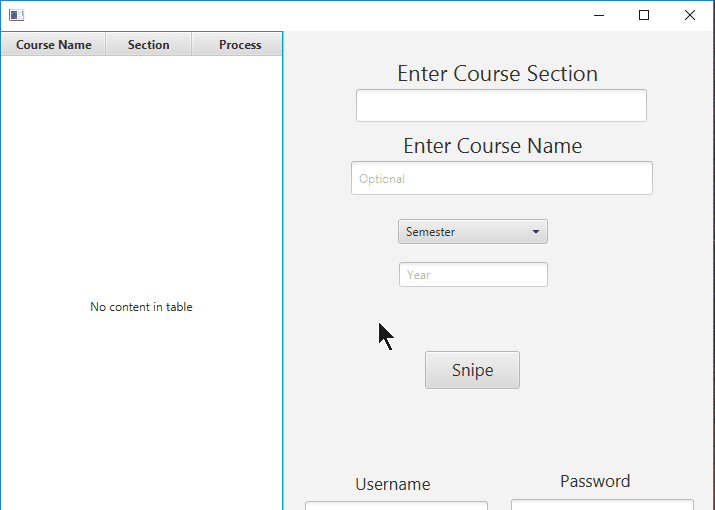

# RU Course Tracker
RU Course Tracker is an application which will track a course section's availability until it is open. When a section is available, it will register under the given student account. 

## Demo

